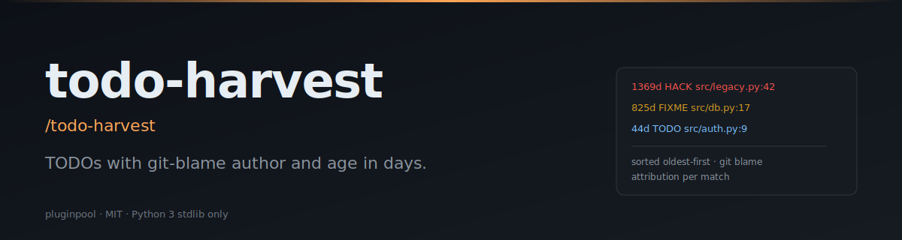

# todo-harvest

**Find the oldest, most-forgotten TODOs and put their authors on blast (constructively).**

[](./LICENSE)
[](https://www.python.org/)
[](https://docs.claude.com/en/docs/claude-code/overview)
[](./tests)

> **TL;DR:** `/todo-harvest` → markdown table of every `TODO/FIXME/HACK` with `git blame` author + age in days, sorted oldest-first.

#### Writing

**LinkedIn**
- 🗡️ [Çift Yüzlü Katana: Yapay Zeka Dönüşümlerinin Gerçekçi Bir Analizi](https://www.linkedin.com/pulse/%C3%A7ift-y%C3%BCzl%C3%BC-katana-yapay-zeka-d%C3%B6n%C3%BC%C5%9F%C3%BCmlerinin-ger%C3%A7ek%C3%A7i-bir-mehmet-turac-80h7f) — AI transformations realistic analysis. The 5 illusions that compound into expensive, fragile systems.
- 📄 [LinkedIn Articles](https://www.linkedin.com/in/mehmetturac/recent-activity/articles/) — All published articles
- 📊 [LinkedIn Documents](https://www.linkedin.com/in/mehmetturac/recent-activity/documents/) — Research papers and technical documents

**Dev.to**
- [Why AI Agents Fail?](https://dev.to/turacthethinker/why-ai-agents-fail-ddg)
- [We Ship to Production Without Tests. Here's How It Destroyed Us.](https://dev.to/turacthethinker/we-ship-to-production-without-tests-heres-how-it-destroyed-us-i4i)
- [I built a product in one AI session. Here's the system that made it ship right.](https://dev.to/turacthethinker/i-built-a-product-in-one-ai-session-heres-the-system-that-made-it-ship-right-3mb3)
- [Remote Work Didn't Break Productivity — It Broke Human Connection](https://dev.to/turacthethinker/remote-work-didnt-break-productivity-it-broke-human-connection-288o)
- [Hermes vs OpenClaw: Which AI assistant would you actually trust?](https://dev.to/turacthethinker/hermes-vs-openclaw-which-ai-assistant-would-you-actually-trust-bbl)
- [Strategic LLM Adoption: A Director's Guide to Fine-Tuning Models](https://dev.to/turacthethinker/strategic-llm-adoption-a-directors-guide-to-fine-tuning-models-for-domain-specific-applications-4e37)
- [The Context Window Lie: Why Your LLM Remembers Nothing](https://dev.to/turacthethinker/the-context-window-lie-why-your-llm-remembers-nothing-5h1p)
- [Stop Your AI Agent From Building Tools That Already Exist](https://dev.to/turacthethinker/stop-your-ai-agent-from-building-tools-that-already-exist-6o9)
- [Why Versioned SQL Beats Vector RAG for Agent Memory Systems](https://dev.to/turacthethinker/why-versioned-sql-beats-vector-rag-for-agent-memory-systems-1jo3)
- [I Got Access to 136 AI Models for Free — NVIDIA NIM API Deep Dive](https://dev.to/turacthethinker/i-got-access-to-136-ai-models-for-free-nvidia-nim-api-deep-dive-111o)
- [Your Agent Isn't Reflecting. It's Performing Reflection.](https://dev.to/turacthethinker/your-agent-isnt-reflecting-its-performing-reflection-b41)
- [How I Stopped My AI Agent From Reinventing the Wheel](https://dev.to/turacthethinker/how-i-stopped-my-ai-agent-from-reinventing-the-wheel-24eo)


#### Writing

- ✍️ [**Dev.to · TuracTheThinker**](https://dev.to/turacthethinker) — Technical articles on AI, agentic systems, and production engineering
- 📄 [**LinkedIn Articles**](https://www.linkedin.com/in/mehmetturac/recent-activity/articles/) — Industry insights and analysis
- 📊 [**LinkedIn Documents**](https://www.linkedin.com/in/mehmetturac/recent-activity/documents/) — Research papers and technical documents

- 🗡️ [**Çift Yüzlü Katana: Yapay Zeka Dönüşümlerinin Gerçekçi Bir Analizi**](https://www.linkedin.com/pulse/%C3%A7ift-y%C3%BCzl%C3%BC-katana-yapay-zeka-d%C3%B6n%C3%BC%C5%9F%C3%BCmlerinin-ger%C3%A7ek%C3%A7i-bir-mehmet-turac-80h7f) — AI transformations realistic analysis. The 5 illusions that compound into expensive, fragile systems. (LinkedIn, 2026)


## Install (Claude Code)

```sh
git clone https://github.com/mturac/pluginpool-todo-harvest ~/.claude/plugins/todo-harvest
```

Restart Claude Code; the slash command `/todo-harvest` appears.

#### Writing

- ✍️ [**Dev.to · TuracTheThinker**](https://dev.to/turacthethinker) — Technical articles on AI, agentic systems, and production engineering
- 📄 [**LinkedIn Articles**](https://www.linkedin.com/in/mehmetturac/recent-activity/articles/) — Industry insights and analysis
- 📊 [**LinkedIn Documents**](https://www.linkedin.com/in/mehmetturac/recent-activity/documents/) — Research papers and technical documents

- 🗡️ [**Çift Yüzlü Katana: Yapay Zeka Dönüşümlerinin Gerçekçi Bir Analizi**](https://www.linkedin.com/pulse/%C3%A7ift-y%C3%BCzl%C3%BC-katana-yapay-zeka-d%C3%B6n%C3%BC%C5%9F%C3%BCmlerinin-ger%C3%A7ek%C3%A7i-bir-mehmet-turac-80h7f) — AI transformations realistic analysis. The 5 illusions that compound into expensive, fragile systems. (LinkedIn, 2026)


## Quick start

```sh
/todo-harvest
```

Or directly:

```sh
python3 scripts/harvest.py --format md
python3 scripts/harvest.py --min-age 180 --format md     # only stuff older than 6 months
python3 scripts/harvest.py --markers TODO,FIXME --format json
```

#### Writing

- ✍️ [**Dev.to · TuracTheThinker**](https://dev.to/turacthethinker) — Technical articles on AI, agentic systems, and production engineering
- 📄 [**LinkedIn Articles**](https://www.linkedin.com/in/mehmetturac/recent-activity/articles/) — Industry insights and analysis
- 📊 [**LinkedIn Documents**](https://www.linkedin.com/in/mehmetturac/recent-activity/documents/) — Research papers and technical documents

- 🗡️ [**Çift Yüzlü Katana: Yapay Zeka Dönüşümlerinin Gerçekçi Bir Analizi**](https://www.linkedin.com/pulse/%C3%A7ift-y%C3%BCzl%C3%BC-katana-yapay-zeka-d%C3%B6n%C3%BC%C5%9F%C3%BCmlerinin-ger%C3%A7ek%C3%A7i-bir-mehmet-turac-80h7f) — AI transformations realistic analysis. The 5 illusions that compound into expensive, fragile systems. (LinkedIn, 2026)


## Flags

| Flag | Default | Description |
|---|---|---|
| `--repo` | cwd | Repo path |
| `--markers` | `TODO,FIXME,HACK,XXX,NOTE` | Comma-separated marker words |
| `--min-age` | `0` | Only show markers ≥ N days old |
| `--format` | `json` | `json` or `md` |

#### Writing

- ✍️ [**Dev.to · TuracTheThinker**](https://dev.to/turacthethinker) — Technical articles on AI, agentic systems, and production engineering
- 📄 [**LinkedIn Articles**](https://www.linkedin.com/in/mehmetturac/recent-activity/articles/) — Industry insights and analysis
- 📊 [**LinkedIn Documents**](https://www.linkedin.com/in/mehmetturac/recent-activity/documents/) — Research papers and technical documents

- 🗡️ [**Çift Yüzlü Katana: Yapay Zeka Dönüşümlerinin Gerçekçi Bir Analizi**](https://www.linkedin.com/pulse/%C3%A7ift-y%C3%BCzl%C3%BC-katana-yapay-zeka-d%C3%B6n%C3%BC%C5%9F%C3%BCmlerinin-ger%C3%A7ek%C3%A7i-bir-mehmet-turac-80h7f) — AI transformations realistic analysis. The 5 illusions that compound into expensive, fragile systems. (LinkedIn, 2026)


## Example output (markdown)

```
| age (d) | marker | file:line | author | note |
|---|---|---|---|---|
| 1247 | HACK | src/legacy/login.py:42 | Alice (left in 2022) | special-case the demo-account UA |
| 412 | FIXME | src/db.py:81 | Bob | this `n+1` lookup needs a join |
| 88 | TODO | src/auth.py:17 | Cara | wire to the new OAuth2 path |
```

#### Writing

- ✍️ [**Dev.to · TuracTheThinker**](https://dev.to/turacthethinker) — Technical articles on AI, agentic systems, and production engineering
- 📄 [**LinkedIn Articles**](https://www.linkedin.com/in/mehmetturac/recent-activity/articles/) — Industry insights and analysis
- 📊 [**LinkedIn Documents**](https://www.linkedin.com/in/mehmetturac/recent-activity/documents/) — Research papers and technical documents

- 🗡️ [**Çift Yüzlü Katana: Yapay Zeka Dönüşümlerinin Gerçekçi Bir Analizi**](https://www.linkedin.com/pulse/%C3%A7ift-y%C3%BCzl%C3%BC-katana-yapay-zeka-d%C3%B6n%C3%BC%C5%9F%C3%BCmlerinin-ger%C3%A7ek%C3%A7i-bir-mehmet-turac-80h7f) — AI transformations realistic analysis. The 5 illusions that compound into expensive, fragile systems. (LinkedIn, 2026)


## How it works

1. Uses `git ls-files` so untracked + `.gitignore`d files are skipped.
2. Detects worktrees correctly (`.git` can be a file pointer, not a directory).
3. Skips binary files (null byte in first 1 KB).
4. Matches markers as whole words: `TODO`, `TODO:`, `# TODO …`.
5. Runs `git blame --porcelain -L N,N -- <file>` per match for the original author + author-time.

#### Writing

- ✍️ [**Dev.to · TuracTheThinker**](https://dev.to/turacthethinker) — Technical articles on AI, agentic systems, and production engineering
- 📄 [**LinkedIn Articles**](https://www.linkedin.com/in/mehmetturac/recent-activity/articles/) — Industry insights and analysis
- 📊 [**LinkedIn Documents**](https://www.linkedin.com/in/mehmetturac/recent-activity/documents/) — Research papers and technical documents

- 🗡️ [**Çift Yüzlü Katana: Yapay Zeka Dönüşümlerinin Gerçekçi Bir Analizi**](https://www.linkedin.com/pulse/%C3%A7ift-y%C3%BCzl%C3%BC-katana-yapay-zeka-d%C3%B6n%C3%BC%C5%9F%C3%BCmlerinin-ger%C3%A7ek%C3%A7i-bir-mehmet-turac-80h7f) — AI transformations realistic analysis. The 5 illusions that compound into expensive, fragile systems. (LinkedIn, 2026)


## Limitations

- One `git blame` call per match means it's slow on huge repos — use `--min-age` or `--markers` to narrow.
- "Age" is the age of the *current* line. Renames and reformats reset the clock.
- Unicode-safe (decodes with `errors="replace"`).

#### Writing

- ✍️ [**Dev.to · TuracTheThinker**](https://dev.to/turacthethinker) — Technical articles on AI, agentic systems, and production engineering
- 📄 [**LinkedIn Articles**](https://www.linkedin.com/in/mehmetturac/recent-activity/articles/) — Industry insights and analysis
- 📊 [**LinkedIn Documents**](https://www.linkedin.com/in/mehmetturac/recent-activity/documents/) — Research papers and technical documents

- 🗡️ [**Çift Yüzlü Katana: Yapay Zeka Dönüşümlerinin Gerçekçi Bir Analizi**](https://www.linkedin.com/pulse/%C3%A7ift-y%C3%BCzl%C3%BC-katana-yapay-zeka-d%C3%B6n%C3%BC%C5%9F%C3%BCmlerinin-ger%C3%A7ek%C3%A7i-bir-mehmet-turac-80h7f) — AI transformations realistic analysis. The 5 illusions that compound into expensive, fragile systems. (LinkedIn, 2026)


## Examples

Step-by-step walkthroughs with real input fixtures and the helper's actual output live in [`examples/`](./examples/README.md). Three or four scenarios per plugin — from the happy path to the edge cases the test suite guards.

#### Writing

- ✍️ [**Dev.to · TuracTheThinker**](https://dev.to/turacthethinker) — Technical articles on AI, agentic systems, and production engineering
- 📄 [**LinkedIn Articles**](https://www.linkedin.com/in/mehmetturac/recent-activity/articles/) — Industry insights and analysis
- 📊 [**LinkedIn Documents**](https://www.linkedin.com/in/mehmetturac/recent-activity/documents/) — Research papers and technical documents

- 🗡️ [**Çift Yüzlü Katana: Yapay Zeka Dönüşümlerinin Gerçekçi Bir Analizi**](https://www.linkedin.com/pulse/%C3%A7ift-y%C3%BCzl%C3%BC-katana-yapay-zeka-d%C3%B6n%C3%BC%C5%9F%C3%BCmlerinin-ger%C3%A7ek%C3%A7i-bir-mehmet-turac-80h7f) — AI transformations realistic analysis. The 5 illusions that compound into expensive, fragile systems. (LinkedIn, 2026)


## Part of the pluginpool family

Ten focused Claude Code plugins for everyday productivity:
[commit-narrator](https://github.com/mturac/pluginpool-commit-narrator) ·
[pr-storyteller](https://github.com/mturac/pluginpool-pr-storyteller) ·
[test-gap](https://github.com/mturac/pluginpool-test-gap) ·
[deps-doctor](https://github.com/mturac/pluginpool-deps-doctor) ·
[env-lint](https://github.com/mturac/pluginpool-env-lint) ·
[secret-guard](https://github.com/mturac/pluginpool-secret-guard) ·
[standup-gen](https://github.com/mturac/pluginpool-standup-gen) ·
[todo-harvest](https://github.com/mturac/pluginpool-todo-harvest) ·
[flaky-detector](https://github.com/mturac/pluginpool-flaky-detector) ·
[changelog-forge](https://github.com/mturac/pluginpool-changelog-forge)

#### Writing

- ✍️ [**Dev.to · TuracTheThinker**](https://dev.to/turacthethinker) — Technical articles on AI, agentic systems, and production engineering
- 📄 [**LinkedIn Articles**](https://www.linkedin.com/in/mehmetturac/recent-activity/articles/) — Industry insights and analysis
- 📊 [**LinkedIn Documents**](https://www.linkedin.com/in/mehmetturac/recent-activity/documents/) — Research papers and technical documents

- 🗡️ [**Çift Yüzlü Katana: Yapay Zeka Dönüşümlerinin Gerçekçi Bir Analizi**](https://www.linkedin.com/pulse/%C3%A7ift-y%C3%BCzl%C3%BC-katana-yapay-zeka-d%C3%B6n%C3%BC%C5%9F%C3%BCmlerinin-ger%C3%A7ek%C3%A7i-bir-mehmet-turac-80h7f) — AI transformations realistic analysis. The 5 illusions that compound into expensive, fragile systems. (LinkedIn, 2026)


## License

MIT — see [`LICENSE`](./LICENSE). Contributions welcome.
